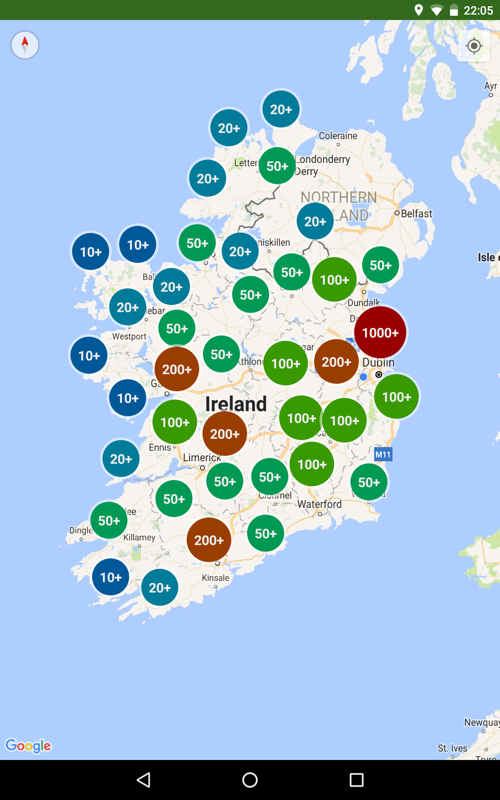
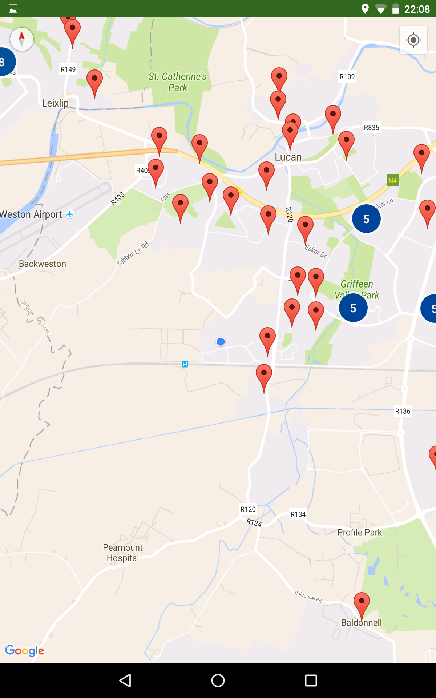
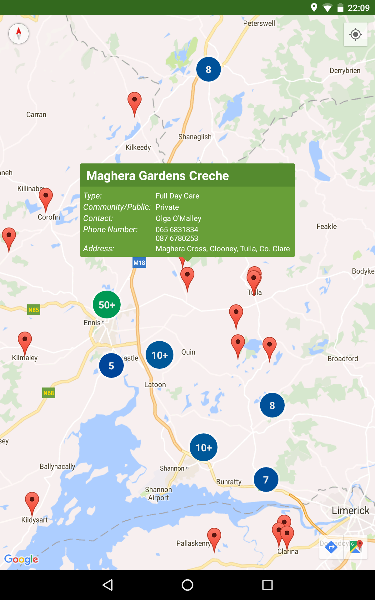

# Pre-School Map
This app shows a majority of the pre-schools in Ireland. It can be used by a parent to find playschools in the area around them.
The app gets data from an online database, which can be updated at any time.

__Unfortunately, this app is no longer maintained and the database has been taken down.__

~The app is available on the play store in: https://play.google.com/store/apps/details?id=com.maps.eb.schoolmap&hl=en~

# Screenshots

* Shows each pre-school as markers on the map. 

* Allows users to see pre-schools around them.

* Displays information about the pre-school.

